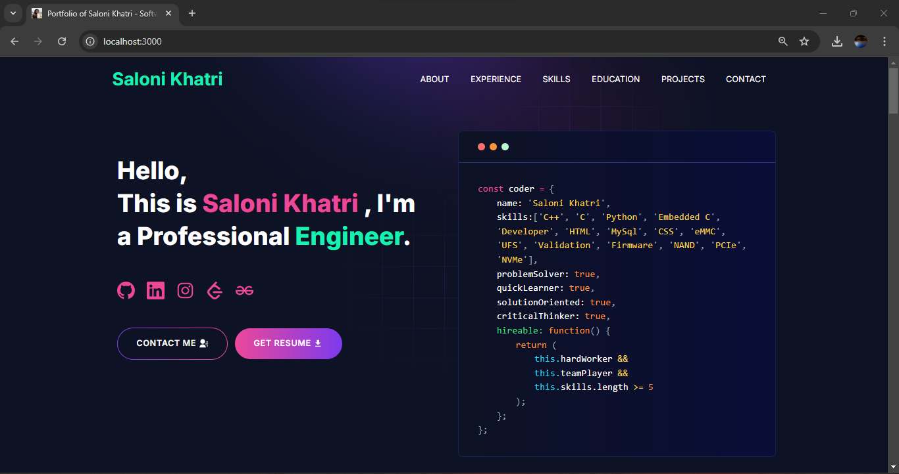

<p align="center" width="100%">
    
</p>

---
# [Built Portfolio With GitHub ](https://github.com/khatrisaloni/saloni-portfolio)

---

# Developer Portfolio

### Struggling to create a professional portfolio website? You're in the right place! With my portfolio template, you can quickly build your own personalized website today. It's user-friendly and easily customizable, making it ideal for both developers and freelancers alike.

---

# Demo :movie_camera:



---

## Table of Contents :scroll:

- [Sections](#sections-bookmark)
- [Installation](#installation-arrow_down)
- [Getting Started](#getting-started-dart)
- [Packages Used](#packages-used-package)

---

# Sections :bookmark:

- INTRODUCTION
- ABOUT ME
- EXPERIENCE
- SKILLS
- PROJECTS
- EDUCATION
- CONTACTS

---

# Installation :arrow_down:

### You will need to download Git and Node to run this project

- [Git](https://git-scm.com/downloads)
- [Node](https://nodejs.org/en/download/)

#### Make sure you have the latest version of both Git and Node on your computer.

```
node --version
git --version
```

## <br />

# Getting Started :dart:

### Fork and Clone the repo

To Fork the repo click on the fork button at the top right of the page. Once the repo is forked open your terminal and perform the following commands

```
git clone https://github.com/<YOUR GITHUB USERNAME>/saloni-portfolio.git

cd saloni-portfolio
```

### Install packages from the root directory

```bash
npm install
# or
yarn install
```

Then, run the development server:

```bash
npm run dev
# or
yarn dev
```

Open [http://localhost:3000](http://localhost:3000) with your browser to see the result.

---

Eg:

```javascript
export const personalData = {
  name: "Saloni Khatri",
  profile: '/profile.jpg',
  designation: "Engineer",
  description: "My name is Saloni Khatri. I am an ambitious and target oriented person who loves to code. With 3+ years of experience in the tech industry, I have honed my skills in tackling problems, finding future proof solutions, and maintaining overall product quality. Enthusiastic about getting myself familiar with new emerging technologies.I am available for any kind of job opportunity that suits my skills and interests.",
  email: 'khatrisaloni17@gmail.com',
  phone: '+919413074918',
  address: 'Hyderabad, Telangana, India - 500084 ',
  github: 'https://github.com/khatrisaloni',
  instagram: 'https://www.instagram.com/khatrisaloni17/?igsh=MTIyZjVzcGd6ejdu',
  linkedIn: 'https://www.linkedin.com/in/saloni-khatri17/',
  gfg: 'https://www.geeksforgeeks.org/user/salonikhatri/',
  codingNinjas: 'https://www.naukri.com/code360/profile/d40668a3-1138-428d-963b-6eea34946bfd',
  leetcode: "https://leetcode.com/u/khatrisaloni17/",
  resume: "https://drive.google.com/file/d/1ZwWT2waOb5OkjNYLUh7adeeS781nUBRy/view?usp=drivesdk"
};
```


---

---

# Packages Used :package:

| Used Package List  |
| :----------------: |
|        next        |
|  @emailjs/browser  |
|    lottie-react    |
| react-fast-marquee |
|    react-icons     |
|   react-toastify   |
|        sass        |
|    tailwindcss     |

---
